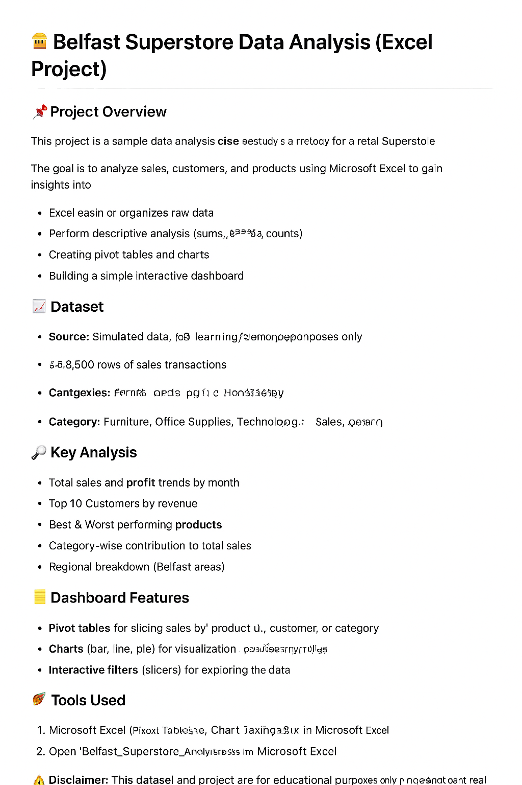
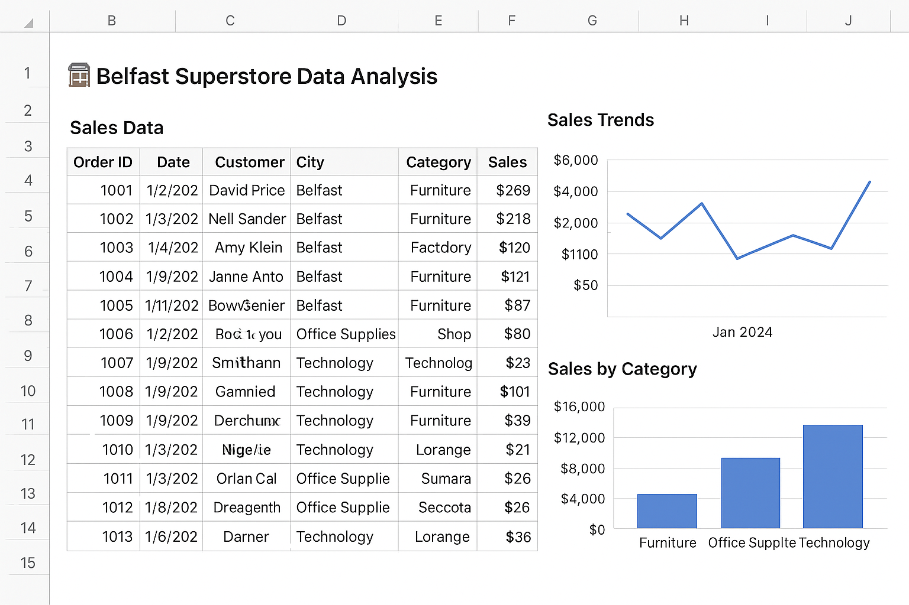

# Superstore-Analysis
# 🏪 Belfast Superstore Data Analysis (Excel Project)

## 📌 Project Overview
This project is a sample for a retail Superstore in Belfast.  
The goal is to analyze sales, customers, and products using **Microsoft Excel** to gain insights into business performance.  

It demonstrates how Excel can be used for:
- Cleaning and organizing raw data
- Performing descriptive analysis (sums, averages, counts)
- Creating pivot tables and charts
- Building a simple interactive dashboard

---

## 📊 Dataset
- **Source**: Simulated data (for learning/demo purposes only)  
- **Size**: ~5,000 rows of sales transactions  
- **Columns**:
  - Order ID
  - Date
  - Customer Name
  - City (Belfast)
  - Category (Furniture, Office Supplies, Technology)
  - Sales
  - Quantity
  - Profit

---

## 🔎 Key Analysis
- **Total Sales & Profit** trends by month  
- **Top 10 Customers** by revenue  
- **Best & Worst Performing Products**  
- **Category-wise Contribution** to total sales  
- **Regional Breakdown** (Belfast areas)  

---

## 📈 Dashboard Features
The Excel dashboard includes:
- Pivot tables for slicing sales by product, customer, or category  
- Charts (bar, line, pie) for visualization  
- Interactive filters (slicers) for exploring the data  

---

## 🛠️ Tools Used
- Microsoft Excel (Pivot Tables, Charts, Dashboard Design)  
- Basic Excel formulas (SUM, AVERAGE, IF, LOOKUP)  

---

## 🎯 Insights (Example Findings)
- Technology category generates the **highest profit margin**.  
- Office Supplies sells the most units but has **lowest profitability**.  
- Certain high-value customers account for **a large share of sales**.  
- Sales peak during the **holiday season (Nov–Dec)**.  

---

## 🚀 How to Use
1. Clone or download this repository.  
2. Open `Belfast_Superstore_Analysis.xlsx` in Microsoft Excel.  
3. Explore pivot tables, charts, and the dashboard.  

---

## 📬 Author
Oluwatobiloba Omoyele  
📧 Omoyeletobiloba92@gmail.com  
🔗 [LinkedIn Profile](www.linkedin.com/in/oluwatobiloba-omoyele-9a6b2b262)  

---

⚠️ **Disclaimer**: This dataset and project are for **educational purposes only**. It does not represent real Belfast Superstore data.

